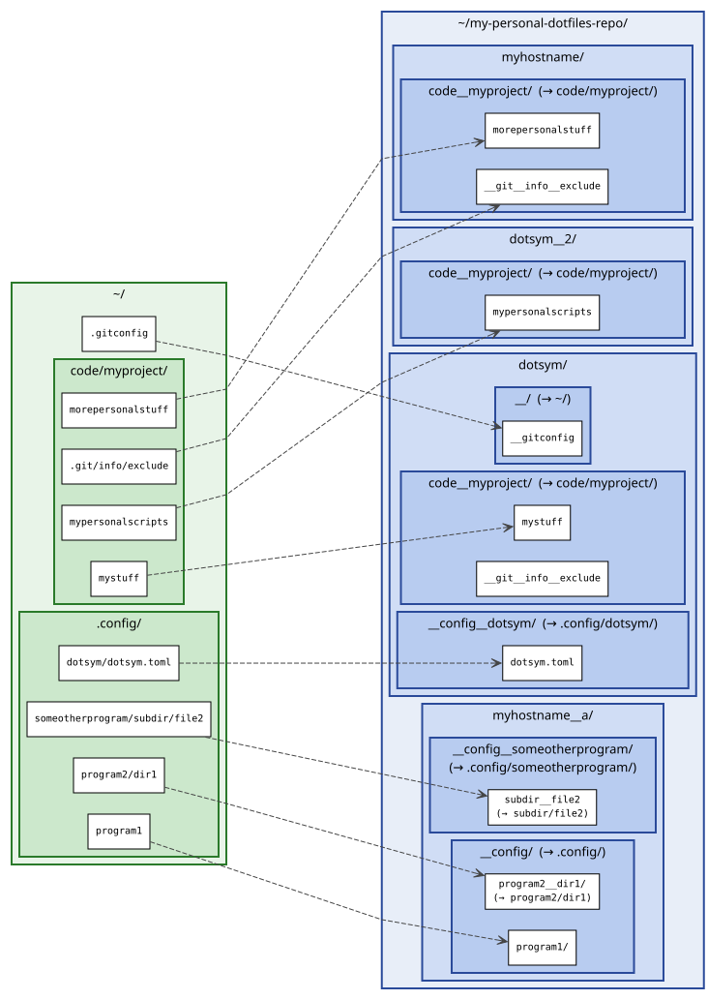

# Dotsym -- dotfile and local overrides management, simplified
dotsym allows you to put **dotfiles in source control** and handle them across multiple machines by making symlinks from the standard location (e.g. ~/.gitconfig) to someplace inside a git repo.

It can also be used for your "local overrides" user-specific configuration, that is, **your own personal files in a project** that you **do not want in the main repo source control**. By symlinking to the files and adding them to your own `.git/config/exclude`, the files can still be kept track of in your own repo.

# Features
* simple to use -- only two config options, the rest is dictated by directory structure
* can have machine-specific override files
* symlink whole directories, or individual files within directories
* ordered directories allow you "layer" shared config in flexible ways (see [Layered example](#Layered-example))

# Config
The configuration is a file in `~/.dotsym/dotsym.toml` (this can also be a symlink to a file managed by dotsym). Example file:

```
separator = "__"
dir = "~/my-personal-dotfiles-repo/"
```

## Separator
The separator string is used for three things:
1. in the middle of filenames, this will expand to '/' (a directory)
2. at the start of filenames, this becomes a "." -- this is done for
   convenience to allow destination files be visible
3. in directories, to have multiple directories for the same hostname (or
   "dotsym" for all hosts), anything after this will be ignored.

## Directory with the dotsym destination directories
dotsym uses a directory hierarchy 2 levels deep:
* The first level is the "host directory", either:
  - `dotsym`, or `dotsym__anything`
  - `myhostname`, or `myhostname__anything`. Destinations in this directory
     will only be applied if the hostname given by the hostname command matches.
  The symlinks are applied in sorted order, e.g. `dotsym`, `dotsym__01`, `dotsym__02`, ...
* The second level, underneath each host directory, is the "literal
  directory". This portion of the path is the directory in which the link
  should be created. This is a directory relative to the user's home
  directory. The filename is expanded to a path following the expansions
  rules below. Note the semi-special case of the separator alone (e.g. `__`)
  meaning the home directory.
* Inside these "literal directoreies" are the "symlink destinations". These are
  the files, directories, or symlinks directly inside each literal directory.
  The symlinks created will point to these files. They are also expanded in
  accordance with the expansion rules below. The destinations may be files,
  directories, or even symlinks.
Also note that if any expansions would create the same symlink to
different files (in different host directories and/or literal
directories), the last one wins (where sort order is `dotsym` then the
hostname for host directories, and sort order for literal directories and
any `__*` in the host directory)

Expansion rules for literal directories and symlink destinations:
* any separator in the middle of a name will change to a `/` (directory
  separator)
* Any leading separator will change to a dot (`.`) (this is strictly for
  convenience, so literal directories and destination files won't start with a
  dot even if the file in the needed dotfile location does).

# Example


Example directory hierarchy, assuming `__` separator:
```
~/my-personal-dotfiles-repo/
  dotsym/
    __/
      __gitconfig
    __config__dotsym/
      dotsym.toml
    code__myproject/
      __git__info__exclude
      mystuff
  dotsym__2/
    code__myproject/
      mypersonalscripts
  myhostname/
    code__myproject/
      __git__info__exclude
     morepersonalstuff
  myhostname__a/
     __config/
       program1/
       program2__dir1/
     __config__someotherprogram/
       subdir__file2
  otherhostname/
    __config/
      program1/
```

Now, with that structure, for host myhostname, dotsym will ensure the following
links (example output from dotsym preview)

```
/home/me/.gitconfig
/home/me/my-personal-dotfiles-repo/dotsym/__/__gitconfig

/home/me/.config/dotsym/dotsym.toml
/home/me/my-personal-dotfiles-repo/dotsym/__config_dotsym/dotsym.toml

/home/me/code/myproject/mystuff
/home/me/my-personal-dotfiles-repo/dotsym/code__myproject/mystuff

/home/me/code/myproject/mypersonalscripts
/home/me/my-personal-dotfiles-repo/dotsym__2/code__myproject/mypersonalscripts

/home/me/code/myproject/.git/info/exclude
/home/me/my-personal-dotfiles-repo/myhostname/code__myproject/__git__info__exclude

/home/me/code/myproject/morepersonalstuff
/home/me/my-personal-dotfiles-repo/myhostname/code__myproject/morepersonalstuff

/home/me/.config/program1
/home/me/my-personal-dotfiles-repo/myhostname__a/__config/program1

/home/me/.config/program2/dir1
/home/me/my-personal-dotfiles-repo/myhostname__a/__config/program2__dir1

/home/me/.config/someotherprogram/subdir/file2
/home/me/my-personal-dotfiles-repo/myhostname__a/__config__someotherprogram/subdir__file2
```

Note that in addition to dotfile management, this example shows how you can
have your own `mypersonalscripts` directory which is kept outside of the
project's main source control.

## Layered example

The above example shows how symlinks in `dotsym` and `dotsym__2` are applied in
order. Here is a simpler example to illustrate this feature's usefulness. Let's
say you can a project "myproject" with three git worktrees, `myproject-a`,
`myproject-b`, and `myproject-c`. All three should use your personal `.env`
file, but all three need different `config/database.yml` files. You can have a
`dotsym/` directory structure like this:

```
~/my-personal-dotfiles-repo/
  dotsym/
     code__myproject-a/
       __env
     code__myproject_b -> code__myproject-a
     code__myproject_c -> code__myproject-a
   dotsym__2/
     code__myproject-a/
       config__database.yml
     code__myproject-b/
       config__database.yml
     code__myproject-c/
       config__database.yml
 ```

`dotsym/code__myproject-b` is a symlink to `code__myproject-a`, so changes you
make in `code__myproject-a/` will get applied to all three worktrees, but the
files in `dotsym__2/**` are specific to each worktree.

# Usage
1. `dotsym apply`. The main command. This creates the symlinks as indicated by
   the config TOML file and the directory structure in the directory. If any
   symlinks are already installed pointing to their correct location, they will
   be skipped. Any other files that would be overwritten are backed up with
   ".~1~", ".~2~", etc. Any directories that need to be created in order to
   make the symlink are created (and backed up if the directory is actually a
   file rather than a directory or symlink). If your
   `~/.config/dotsym/dotsym.toml` is to be managed with dotsym, you can use the
   bootstrap command first.
   Use with the `--dry-run` / `-n` flag to preview what changes would be made.
2. Bootstrap: `dotsym setup [DIRECTORY] [SEPARATOR]`. This essentially loads a
   one-time config with the directory and separator given, and creates just the
   the ~/.config/dotsym/dotsym.toml symlink as would be done by the apply
   command. In other words, in looks in the directory tree given by DIRECTORY
   for a file to symlink (e.g. `dotsym__foo/__config/__dotsym__dotsym.toml`,
   `myhostname/__config__dotsym/dotsym.toml`, etc.) and instals the symlink to
   `~/.config/dotsym/dotsym.toml`.
3. `dotsym preview` is similar to `dotsym apply --dry-run` but does not check
   the status of the files in your home directory: it simply prints out the
   source and destination of each symlink managed. See the example output
   above.

# Building static binary
```
rustup target add x86_64-unknown-linux-musl
cargo build --release --target x86_64-unknown-linux-musl
```

